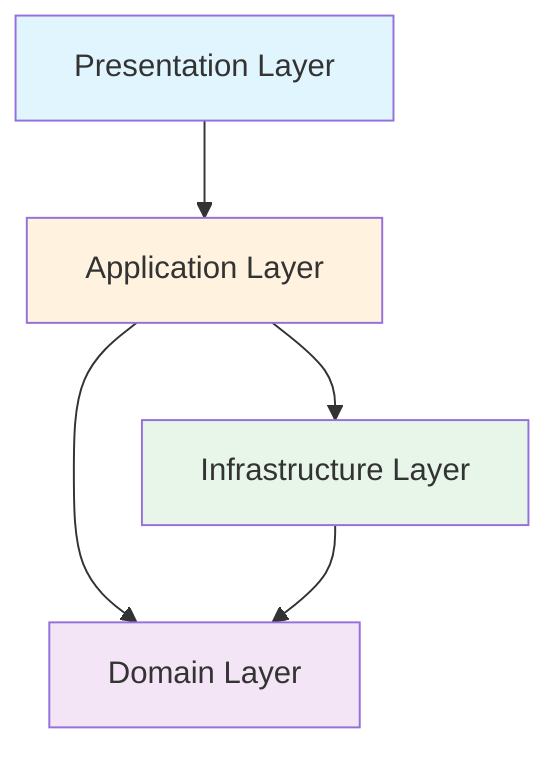

# レイヤードアーキテクチャ学習ゲーム「Architecture Quest」開発計画書

## 1. プロジェクト概要

### 1.1 ビジョン
レイヤードアーキテクチャの概念を、実践的かつ楽しく学べるゲーミフィケーション学習プラットフォームを構築する。

### 1.2 ミッション
- ソフトウェアアーキテクチャの基礎概念を視覚的・体験的に理解できる環境の提供
- 実践的なコーディングスキルとアーキテクチャ設計能力の向上
- エンジニアコミュニティでの知識共有とコラボレーションの促進

### 1.3 ターゲットユーザー
- **初級エンジニア**: アーキテクチャの基礎を学びたい方
- **中級エンジニア**: 設計スキルを向上させたい方
- **教育者**: プログラミング教育の教材として活用したい方
- **学生**: ソフトウェア工学を学習中の方

## 2. ゲームコンセプト

### 2.1 基本コンセプト
プレイヤーは「デジタルアーキテクト」として、様々なシステムの設計・構築を行う。正しいレイヤー構造を維持しながら、機能を実装し、バグを修正し、システムを成長させていく。

### 2.2 コアゲームプレイ
- **パズル要素**: コードブロックを適切なレイヤーに配置
- **戦略要素**: 依存関係を考慮した設計判断
- **RPG要素**: キャラクター成長とスキルツリー
- **ソーシャル要素**: 他プレイヤーとの協力・競争

### 2.3 測定可能な学習目標

#### 第1章：プレゼンテーション層
| 学習項目 | 達成基準 | 測定方法 |
|---------|---------|----------|
| UI/ビジネスロジックの分離 | 表示ロジック混入率 ≦ 5% | 自動検証 |
| 依存方向の理解 | 逆依存件数 = 0 | バリデーション |
| DTOの適切な使用 | UI型混入件数 = 0 | 型チェック |

#### 第2章：アプリケーション層
| 学習項目 | 達成基準 | 測定方法 |
|---------|---------|----------|
| ユースケースの実装 | 副作用の局所化率 ≧ 90% | コード解析 |
| トランザクション境界 | 不整合発生率 = 0% | シミュレーション |
| 層間の調整 | 循環依存 = 0 | 依存グラフ解析 |

#### 第3章：ドメイン層
| 学習項目 | 達成基準 | 測定方法 |
|---------|---------|----------|
| ビジネスルールの独立性 | 外部依存 = 0 | 静的解析 |
| エンティティ設計 | 凝集度スコア ≧ 80 | メトリクス計算 |
| 値オブジェクトの活用 | プリミティブ型使用率 ≦ 20% | 型解析 |

#### 第4章：インフラストラクチャ層
| 学習項目 | 達成基準 | 測定方法 |
|---------|---------|----------|
| 技術的詳細の隠蔽 | 漏れ出し検出数 = 0 | インターフェース検査 |
| リポジトリパターン | 実装の差し替え可能性 = 100% | テスト実行 |
| 外部サービス統合 | モック化可能率 = 100% | 依存性注入検証 |

## 3. ゲームモード詳細

### 3.1 ストーリーモード
**概要**: 段階的にレイヤードアーキテクチャを学習する物語形式のキャンペーン

**章構成**:
1. **第1章: プレゼンテーション層の冒険**
   - UI/UXの基礎
   - ユーザー入力の処理
   - 表示ロジックの分離

2. **第2章: アプリケーション層の試練**
   - ユースケースの実装
   - ビジネスロジックの調整
   - トランザクション管理

3. **第3章: ドメイン層の深淵**
   - エンティティとバリューオブジェクト
   - ドメインサービスの設計
   - ビジネスルールの実装

4. **第4章: インフラストラクチャ層の基盤**
   - データ永続化
   - 外部システム連携
   - 技術的実装の詳細

5. **第5章: 統合の極意**
   - 全レイヤーの協調
   - 大規模システムの構築
   - パフォーマンス最適化

### 3.2 チャレンジモード
**デイリーチャレンジ**:
- 毎日更新される設計問題
- SRSに基づく個別弱点の再出題（前回失敗ルールを優先）
- タイムアタック形式
- グローバルランキング（Phase 3以降）

**ウィークリートーナメント**:
- テーマ別の設計コンテスト
- コミュニティ投票による評価
- 報酬とバッジの獲得

### 3.3 サンドボックスモード
**機能**:
- 自由な設計環境
- カスタムシナリオの作成
- コードエクスポート機能
- 設計パターンライブラリ

### 3.4 マルチプレイヤーモード
**協力プレイ**:
- 2-4人でのチーム開発
- 役割分担システム
- リアルタイムコラボレーション

**対戦モード**:
- 1対1のアーキテクチャバトル
- スピード設計競争
- コードレビュー対決

## 4. ゲームメカニクス

### 4.1 基本メカニクス
- **ドラッグ&ドロップ**: コードブロックの配置
- **コネクション**: レイヤー間の依存関係の構築
- **バリデーション**: 設計の正当性チェック
- **リファクタリング**: 既存構造の改善

#### 4.1.1 バリデーションルール
**必須ルール**:
- 依存方向: Presentation → Application → Domain。Infrastructure → Domain は可
- 禁止参照: Presentation → Infrastructure、Domain → (Application/Presentation/Infrastructure)
- 循環依存: 全レイヤーで0
- DTO純度: DTOにUI型/コールバック（onClickなど）を含めない
- Fat/God判定: サービス行数閾値/メソッド数閾値で警告

**評価用メトリクス（UIに簡易表示）**:
- 循環数(CC): 0 が目標
- 参照外向き比(Efferent) と内向き比(Afferent)の簡易指標
- ユースケース単体テスト有無（Yes/No）

### 4.2 スコアリングシステム
```
総合スコア = 0.35×正確性 + 0.25×効率性 + 0.25×保守性 + 0.15×速度
            + ボーナス

- 正確性: レイヤー配置/依存方向の遵守度 (0-100)
- 効率性: 依存の最小化・無駄の少なさ (0-100)
- 保守性: 循環依存0/凝集度/結合度の指標から算出 (0-100)
- 速度: 時間閾値を超えるごとに逓減
- ボーナス: アンチパターン検出0件 +5%、ヒント未使用 +5%
```

### 4.3 進行システム
- **経験値(XP)**: 課題クリアで獲得
- **レベル**: 1-100までの成長システム
- **スキルツリー**: 専門分野の深化
- **実績**: 特定条件達成での解放

### 4.4 報酬システム
- **コイン**: ゲーム内通貨
- **ジェム**: プレミアム通貨
- **スキン**: キャラクター/UI外観
- **ツール**: 設計支援アイテム

## 5. 技術仕様

### 5.1 技術スタック

#### フロントエンド
```yaml
コア技術:
  言語: TypeScript 5.7+
  フレームワーク: Vue 3.5+
  ゲームエンジン: Phaser 3.86+
  
状態管理:
  グローバル: Pinia 2.3+
  ローカル: Composition API
  
スタイリング:
  CSS Framework: Tailwind CSS 3.4+
  プリプロセッサ: Sass/SCSS
  アニメーション: Motion One（@motionone/vue） / @vueuse/motion / GSAP 3.12+
  
ビルド・開発:
  ビルドツール: Vite 6.0+
  パッケージマネージャー: pnpm 9.x
  型チェック: TypeScript strict mode
```

#### バックエンド
```yaml
コア技術:
  ランタイム: Bun 1.2+ / Node.js 22+ LTS
  フレームワーク: Hono 4.x
  言語: TypeScript 5.7+
  
データベース:
  メイン: PostgreSQL 17
  ORM: Prisma 6.x
  キャッシュ: Redis 7.4+
  
API:
  プロトコル: REST / GraphQL
  認証: JWT + OAuth2
  リアルタイム: WebSocket (Socket.io)
```

#### インフラストラクチャ
```yaml
ホスティング:
  フロントエンド: Vercel / Netlify
  バックエンド: Railway / Render
  データベース: Supabase / Neon
  
CI/CD:
  パイプライン: GitHub Actions
  環境: Dev / Staging / Production
  
モニタリング:
  APM: Sentry
  分析: GA4（流入） + PostHog/Amplitude（学習イベント）
  ログ: LogRocket
  計測イベント例: rule_failed, cyclic_detected, hint_opened, retry, srs_recall_correct
```

### 5.2 アーキテクチャ設計

#### ディレクトリ構造
```
layered-architecture-game/
├── apps/
│   ├── client/                 # フロントエンドアプリケーション
│   │   ├── src/
│   │   │   ├── presentation/   # プレゼンテーション層
│   │   │   │   ├── components/ # UIコンポーネント
│   │   │   │   ├── views/      # ページビュー
│   │   │   │   ├── game/       # ゲーム画面
│   │   │   │   └── composables/# Vue Composables
│   │   │   ├── application/    # アプリケーション層
│   │   │   │   ├── usecases/   # ユースケース
│   │   │   │   ├── dto/        # データ転送オブジェクト
│   │   │   │   └── services/   # アプリケーションサービス
│   │   │   ├── domain/         # ドメイン層
│   │   │   │   ├── entities/   # エンティティ
│   │   │   │   ├── valueObjects/# 値オブジェクト
│   │   │   │   ├── repositories/# リポジトリインターフェース
│   │   │   │   └── services/   # ドメインサービス
│   │   │   └── infrastructure/ # インフラストラクチャ層
│   │   │       ├── api/        # API通信
│   │   │       ├── repositories/# リポジトリ実装
│   │   │       ├── game-engine/# Phaser統合
│   │   │       └── storage/    # ローカルストレージ
│   │   └── tests/              # テストファイル
│   │
│   └── server/                  # バックエンドアプリケーション
│       ├── src/
│       │   ├── presentation/   # API層
│       │   ├── application/    # ビジネスロジック
│       │   ├── domain/         # ドメインモデル
│       │   └── infrastructure/ # データアクセス層
│       └── tests/
│
├── packages/                    # 共有パッケージ
│   ├── shared-domain/          # エンティティ/VO/DTO/ルール（クリーンな依存の中心）
│   ├── validation-rules/       # バリデーションと採点ロジック（クライアント/サーバ共有）
│   ├── challenge-spec/         # 課題スキーマとサンプル
│   ├── shared-types/           # 型定義
│   ├── game-engine/            # ゲームエンジンコア
│   └── ui-library/             # 共通UIコンポーネント
│
├── docs/                        # ドキュメント
├── scripts/                     # ビルド・デプロイスクリプト
└── configs/                     # 設定ファイル
```

#### レイヤー間の依存関係


### 5.3 データモデル

#### 主要エンティティ
```typescript
// ユーザー
interface User {
  id: string;
  username: string;
  email: string;
  level: number;
  experience: number;
  achievements: Achievement[];
  statistics: UserStatistics;
}

// ゲームセッション
interface GameSession {
  id: string;
  userId: string;
  mode: GameMode;
  startedAt: Date;
  completedAt?: Date;
  score: number;
  metrics: SessionMetrics;
}

// レイヤー構造
interface LayerStructure {
  id: string;
  sessionId: string;
  layers: Layer[];
  connections: Connection[];
  validation: ValidationResult;
}

// 学習進捗
interface LearningProgress {
  userId: string;
  completedLessons: string[];
  skillTree: SkillNode[];
  certificates: Certificate[];
}
```

## 6. UI/UXデザイン

### 6.1 デザインコンセプト
- **ビジュアルテーマ**: サイバーパンク × ミニマリズム
- **カラーパレット**: ダークモード基調、ネオンアクセント
- **タイポグラフィ**: モダン等幅フォント
- **アニメーション**: スムーズで教育的な動き

### 6.2 画面構成

#### メインメニュー
- ストーリーモード選択
- チャレンジ一覧
- プロフィール
- 設定

#### ゲーム画面
- レイヤービュー（中央）
- ツールパレット（左）
- プロパティパネル（右）
- スコア・タイマー（上部）
- ヒント・チュートリアル（下部）

#### 結果画面
- スコア詳細
- 改善ポイント
- 次のステップ提案
- シェア機能

### 6.3 アクセシビリティ
- キーボード完全対応
- スクリーンリーダー対応
- カラーブラインド配慮
- フォントサイズ調整

## 7. 開発計画

### 7.1 フェーズ1: MVP開発（2週間）

#### Week 1
- [ ] 開発環境セットアップ
- [ ] 基本的なプロジェクト構造の構築
- [ ] レイヤー表示システムの実装
- [ ] ドラッグ&ドロップ機能

#### Week 2
- [ ] バリデーションシステム
- [ ] スコアリング機能
- [ ] 基本的な3つのレイヤー実装
- [ ] チュートリアルステージ
- [ ] 最小課題スキーマ（JSON利用）
- [ ] ローカル保存（IndexedDB）

### 7.2 フェーズ2: 機能拡張（3週間）

#### Week 3-4
- [ ] ストーリーモード第1章
- [ ] ユーザー認証システム
- [ ] 進捗保存機能
- [ ] 基本的なアニメーション

#### Week 5
- [ ] チャレンジモード最小版（シングル）
- [ ] SRSリピート出題（ローカル）
- [ ] 学習分析基盤の構築
- [ ] パフォーマンス最適化

### 7.3 フェーズ3: ポリッシュ（2週間）

#### Week 6
- [ ] UI/UXの改善
- [ ] パフォーマンス最適化
- [ ] バグ修正
- [ ] アクセシビリティ対応

#### Week 7
- [ ] コミュニティ機能
- [ ] 分析ダッシュボード
- [ ] ドキュメント整備
- [ ] デプロイ準備

## 8. マーケティング戦略

### 8.1 ターゲット市場
- プログラミング学習プラットフォーム
- 企業研修プログラム
- 大学・専門学校の教材
- オンラインコミュニティ

### 8.2 プロモーション
- 技術ブログでの記事公開
- SNSでの情報発信
- オープンソース化の検討
- カンファレンスでのデモ

### 8.3 収益モデル
- **フリーミアム**: 基本無料、追加コンテンツ課金
- **サブスクリプション**: 月額プラン
- **企業向けライセンス**: 団体利用
- **教育機関割引**: アカデミックプラン

## 9. 成功指標（KPI）

### 9.1 ユーザーエンゲージメント
- DAU（Daily Active Users）
- 平均プレイ時間
- リテンション率（1日、7日、30日）
- コンプリート率

### 9.2 学習効果
- レッスン完了率
- スキル習得速度
- 理解度テストスコア
- 実践プロジェクトへの応用率

### 9.3 ビジネス指標
- ユーザー獲得コスト（CAC）
- 顧客生涯価値（LTV）
- 月間経常収益（MRR）
- チャーンレート

## 10. リスクと対策

### 10.1 技術的リスク
| リスク | 影響度 | 対策 |
|--------|--------|------|
| パフォーマンス問題 | 高 | 早期の性能テスト、最適化 |
| ブラウザ互換性 | 中 | クロスブラウザテスト |
| スケーラビリティ | 高 | マイクロサービス設計 |

### 10.2 ビジネスリスク
| リスク | 影響度 | 対策 |
|--------|--------|------|
| 競合製品の出現 | 中 | 差別化機能の強化 |
| ユーザー獲得困難 | 高 | コミュニティ構築 |
| 収益化の遅れ | 中 | 早期の有料機能テスト |

## 11. 課題スキーマ（最小例）

```json
{
  "id": "ch-001",
  "title": "DTOがUIを知ってしまった",
  "goals": [
    "依存方向の遵守",
    "DTOにUI関心を含めない"
  ],
  "given": {
    "layers": ["presentation","application","domain","infrastructure"],
    "blocks": [
      {"id":"ui-1","type":"component","layer":"presentation"},
      {"id":"dto-1","type":"dto","layer":"application","props":["title:string","onClick:() => void"]}
    ],
    "connections": [{"from":"ui-1","to":"dto-1"}]
  },
  "rules": ["dep_direction","no_presentation_to_infra","no_ui_in_dto","no_cycles"],
  "grading": {
    "weights": {"accuracy":0.35,"efficiency":0.25,"maintainability":0.25,"speed":0.15},
    "bonus": {"no_antipatterns":0.05,"no_hints":0.05},
    "timeThresholdSec": 180
  },
  "hints": [
    "DTOはI/O専用。UIの動きはどの層？"
  ],
  "explanations": [
    "DTOにUIのコールバックを含めると層の境界が曖昧になります。"
  ]
}
```

## 12. 今後の展開

### 12.1 追加機能候補
- AI による個別学習支援
- VR/AR 対応
- モバイルアプリ版
- 他のアーキテクチャパターン対応
- コード生成機能

### 12.2 長期ビジョン
- 包括的なソフトウェア設計学習プラットフォーム
- 企業向け研修ソリューション
- 認定資格プログラム
- グローバル展開

## 13. チーム構成（想定）

### 13.1 開発チーム
- **プロダクトマネージャー**: 1名
- **フロントエンドエンジニア**: 2名
- **バックエンドエンジニア**: 1名
- **ゲームデザイナー**: 1名
- **UI/UXデザイナー**: 1名

### 13.2 サポートチーム
- **QAエンジニア**: 1名
- **DevOpsエンジニア**: 1名
- **コンテンツクリエイター**: 1名
- **コミュニティマネージャー**: 1名

## 14. 参考資料

### 14.1 技術文献
- "Clean Architecture" - Robert C. Martin
- "Domain-Driven Design" - Eric Evans
- "Patterns of Enterprise Application Architecture" - Martin Fowler

### 14.2 競合分析
- CodeCombat
- Coding Game
- Human Resource Machine
- TIS-100

### 14.3 学習理論
- ゲーミフィケーション理論
- 認知負荷理論
- スペースドリピティション
- アクティブラーニング

---

## 改訂履歴
- v1.2.0 (2025-01-15): 最終版統合・2025年版ライブラリバージョン更新
- v1.1.0 (2025-01-15): ChatGPTフィードバック反映（P0優先度改善）
- v1.0.0 (2025-01-15): 初版作成

## 連絡先
プロジェクトに関するお問い合わせは、GitHubのIssueにてお願いします。

---

*このドキュメントは継続的に更新されます。最新版は常にリポジトリのメインブランチをご確認ください。*