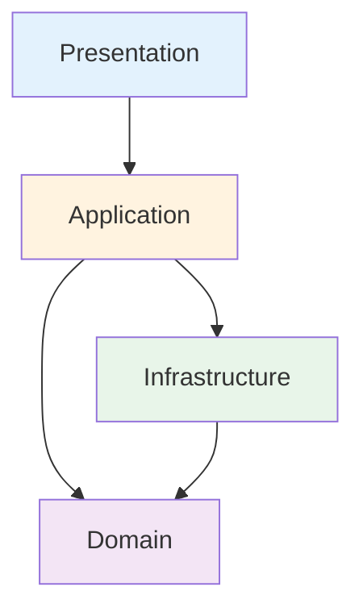
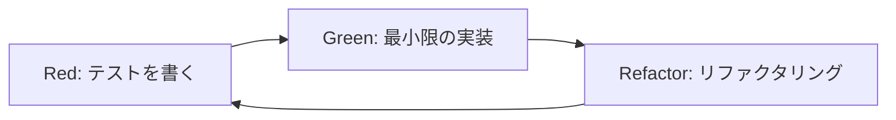

# フロントエンド仕様書

## 1. 概要

### 1.1 アーキテクチャ方針
本プロジェクトのフロントエンドは、**DDD（ドメイン駆動設計）** と **レイヤードアーキテクチャ** を採用し、ビジネスロジックとUIを明確に分離した設計とする。

### 1.2 開発方針
- **TDD（テスト駆動開発）**: t-wada氏が提唱する「テストファースト」による開発
- **ドキュメント駆動**: 仕様を先に定義し、実装はドキュメントに従う
- **型安全性**: TypeScript strict modeによる完全な型安全性

## 2. アーキテクチャ設計

### 2.1 レイヤー構成

```
src/
├── presentation/       # プレゼンテーション層
│   ├── components/    # UIコンポーネント（View）
│   ├── pages/        # ページコンポーネント
│   ├── composables/  # Vue Composition API
│   └── game/         # ゲーム画面専用
│
├── application/       # アプリケーション層
│   ├── usecases/     # ユースケース
│   ├── dto/          # データ転送オブジェクト
│   └── services/     # アプリケーションサービス
│
├── domain/           # ドメイン層
│   ├── models/       # エンティティ・値オブジェクト
│   ├── repositories/ # リポジトリインターフェース
│   ├── services/     # ドメインサービス
│   └── events/       # ドメインイベント
│
└── infrastructure/   # インフラストラクチャ層
    ├── repositories/ # リポジトリ実装
    ├── api/         # API通信
    ├── storage/     # ローカルストレージ
    └── game-engine/ # Phaser統合
```

### 2.2 依存関係のルール



#### 依存関係の原則
1. **Domain層は他の層に依存しない**（最も重要）
2. Presentation層はApplication層のみに依存
3. Infrastructure層はDomain層のインターフェースを実装
4. 循環依存は絶対に禁止

## 3. ドメインモデル設計

### 3.1 コアドメイン

#### 3.1.1 ゲームセッション
```typescript
// domain/models/game-session.ts
export class GameSession {
  private constructor(
    private readonly id: GameSessionId,
    private readonly userId: UserId,
    private readonly challenge: Challenge,
    private state: GameState,
    private readonly startedAt: Date
  ) {}

  static create(userId: UserId, challenge: Challenge): GameSession {
    // ファクトリメソッド
  }

  submitSolution(solution: Solution): ValidationResult {
    // ビジネスロジック
  }

  private validateLayerDependencies(): ValidationResult {
    // ドメインルール
  }
}
```

#### 3.1.2 レイヤー構造
```typescript
// domain/models/layer-structure.ts
export class LayerStructure {
  constructor(
    private readonly layers: Layer[],
    private readonly connections: Connection[]
  ) {}

  addBlock(layerId: LayerId, block: CodeBlock): Result<void> {
    // ブロック追加のビジネスルール
  }

  createConnection(from: BlockId, to: BlockId): Result<Connection> {
    // 依存関係作成のルール検証
  }

  validate(): ValidationResult {
    return new ArchitectureValidator(this).validate();
  }
}
```

### 3.2 値オブジェクト

```typescript
// domain/models/value-objects/score.ts
export class Score {
  private constructor(private readonly value: number) {}

  static create(
    accuracy: number,
    efficiency: number,
    maintainability: number,
    speed: number
  ): Score {
    const base = accuracy * 0.35 + efficiency * 0.25 + 
                 maintainability * 0.25 + speed * 0.15;
    return new Score(Math.round(base));
  }

  addBonus(bonus: Bonus): Score {
    return new Score(this.value * bonus.multiplier);
  }
}
```

## 4. TDD実践仕様

### 4.1 テストファースト開発フロー



### 4.2 テスト戦略

#### 4.2.1 ユニットテストの原則
```typescript
// domain/models/__tests__/layer-structure.spec.ts
describe('LayerStructure', () => {
  describe('addBlock', () => {
    it('プレゼンテーション層にUIコンポーネントを追加できる', () => {
      // Arrange
      const structure = LayerStructure.create();
      const block = new CodeBlock('UserForm', BlockType.Component);
      
      // Act
      const result = structure.addBlock(LayerId.Presentation, block);
      
      // Assert
      expect(result.isSuccess()).toBe(true);
      expect(structure.getLayer(LayerId.Presentation).hasBlock(block)).toBe(true);
    });

    it('ドメイン層にUIコンポーネントを追加できない', () => {
      // Arrange
      const structure = LayerStructure.create();
      const block = new CodeBlock('UserForm', BlockType.Component);
      
      // Act
      const result = structure.addBlock(LayerId.Domain, block);
      
      // Assert
      expect(result.isFailure()).toBe(true);
      expect(result.error).toContain('UIコンポーネントはドメイン層に配置できません');
    });
  });
});
```

#### 4.2.2 統合テストの方針
```typescript
// application/usecases/__tests__/submit-solution.spec.ts
describe('SubmitSolutionUseCase', () => {
  it('正しい解答を提出すると成功する', async () => {
    // テストダブル（モック）の使用
    const mockRepo = new MockGameSessionRepository();
    const useCase = new SubmitSolutionUseCase(mockRepo);
    
    // 実行と検証
    const result = await useCase.execute(solution);
    expect(result.score).toBeGreaterThan(90);
  });
});
```

### 4.3 テスト駆動開発の実践ルール

1. **テストなしにプロダクトコードを書かない**
2. **失敗するテストを書いてから実装する**
3. **テストが通る最小限のコードを書く**
4. **テストが通ったらリファクタリング**
5. **1つのテストは1つの振る舞いのみ検証**

## 5. アプリケーション層設計

### 5.1 ユースケース

```typescript
// application/usecases/start-game-session.ts
export class StartGameSessionUseCase {
  constructor(
    private readonly gameSessionRepository: GameSessionRepository,
    private readonly challengeRepository: ChallengeRepository
  ) {}

  async execute(dto: StartGameDto): Promise<Result<GameSessionDto>> {
    // 1. チャレンジを取得
    const challenge = await this.challengeRepository.findById(dto.challengeId);
    if (!challenge) {
      return Result.fail('チャレンジが見つかりません');
    }

    // 2. ゲームセッションを作成
    const session = GameSession.create(dto.userId, challenge);

    // 3. 保存
    await this.gameSessionRepository.save(session);

    // 4. DTOに変換して返却
    return Result.ok(GameSessionDto.fromDomain(session));
  }
}
```

### 5.2 DTO設計

```typescript
// application/dto/game-session.dto.ts
export class GameSessionDto {
  constructor(
    public readonly id: string,
    public readonly userId: string,
    public readonly challengeId: string,
    public readonly state: string,
    public readonly score: number,
    public readonly startedAt: string
  ) {}

  static fromDomain(session: GameSession): GameSessionDto {
    // ドメインモデルからDTOへの変換
    // UIに関する情報は含まない
  }
}
```

## 6. プレゼンテーション層設計

### 6.1 コンポーネント設計

```vue
<!-- presentation/components/game/LayerView.vue -->
<template>
  <div class="layer-view" :class="layerClass">
    <h3>{{ layer.name }}</h3>
    <div 
      v-for="block in blocks" 
      :key="block.id"
      class="code-block"
      @dragstart="handleDragStart(block)"
      @drop="handleDrop"
    >
      <CodeBlock :block="block" />
    </div>
  </div>
</template>

<script setup lang="ts">
import { computed } from 'vue'
import { useGameSession } from '@/presentation/composables/useGameSession'
import type { LayerDto } from '@/application/dto'

const props = defineProps<{
  layer: LayerDto
}>()

// Composableを使用してビジネスロジックを分離
const { blocks, moveBlock } = useGameSession()

const layerClass = computed(() => `layer-${props.layer.type}`)

const handleDragStart = (block: BlockDto) => {
  // UIイベント処理のみ
}

const handleDrop = async (event: DragEvent) => {
  // ユースケース呼び出し
  await moveBlock(blockId, props.layer.id)
}
</script>
```

### 6.2 Composables（Composition API）

```typescript
// presentation/composables/useGameSession.ts
export function useGameSession() {
  const sessionStore = useSessionStore()
  
  // ユースケースのインスタンス（DIコンテナから取得）
  const submitSolutionUseCase = inject(SubmitSolutionUseCaseToken)
  
  const submitSolution = async () => {
    const result = await submitSolutionUseCase.execute({
      sessionId: sessionStore.currentSessionId,
      solution: buildSolution()
    })
    
    if (result.isSuccess()) {
      // UI更新
      sessionStore.updateScore(result.value.score)
    }
  }
  
  return {
    session: computed(() => sessionStore.session),
    submitSolution
  }
}
```

## 7. インフラストラクチャ層設計

### 7.1 リポジトリ実装

```typescript
// infrastructure/repositories/game-session.repository.ts
export class GameSessionRepositoryImpl implements GameSessionRepository {
  constructor(private readonly apiClient: ApiClient) {}

  async findById(id: GameSessionId): Promise<GameSession | null> {
    const response = await this.apiClient.get(`/sessions/${id.value}`)
    if (!response.data) return null
    
    return GameSessionMapper.toDomain(response.data)
  }

  async save(session: GameSession): Promise<void> {
    const data = GameSessionMapper.toPersistence(session)
    await this.apiClient.post('/sessions', data)
  }
}
```

### 7.2 ローカルストレージ

```typescript
// infrastructure/storage/indexed-db.storage.ts
export class IndexedDBStorage implements LocalStorage {
  private db: IDBDatabase

  async saveProgress(progress: Progress): Promise<void> {
    const transaction = this.db.transaction(['progress'], 'readwrite')
    const store = transaction.objectStore('progress')
    await store.put(progress.toJSON())
  }
}
```

## 8. 状態管理

### 8.1 Pinia Store設計

```typescript
// presentation/stores/session.store.ts
export const useSessionStore = defineStore('session', () => {
  // State
  const session = ref<GameSessionDto | null>(null)
  const isLoading = ref(false)
  const error = ref<string | null>(null)

  // Actions（ユースケース呼び出しのみ）
  const startSession = async (challengeId: string) => {
    isLoading.value = true
    error.value = null
    
    try {
      const useCase = inject(StartGameSessionUseCaseToken)
      const result = await useCase.execute({ challengeId })
      
      if (result.isSuccess()) {
        session.value = result.value
      } else {
        error.value = result.error
      }
    } finally {
      isLoading.value = false
    }
  }

  return {
    session: readonly(session),
    isLoading: readonly(isLoading),
    error: readonly(error),
    startSession
  }
})
```

## 9. エラーハンドリング

### 9.1 ドメインエラー

```typescript
// domain/errors/domain.error.ts
export abstract class DomainError extends Error {
  abstract readonly code: string
}

export class InvalidDependencyError extends DomainError {
  readonly code = 'INVALID_DEPENDENCY'
  
  constructor(from: string, to: string) {
    super(`不正な依存関係: ${from} -> ${to}`)
  }
}
```

### 9.2 アプリケーションエラー

```typescript
// application/errors/application.error.ts
export class UseCaseError extends Error {
  constructor(
    message: string,
    public readonly code: string,
    public readonly statusCode?: number
  ) {
    super(message)
  }
}
```

## 10. テスト設定

### 10.1 Vitest設定

```typescript
// vitest.config.ts
import { defineConfig } from 'vitest/config'
import vue from '@vitejs/plugin-vue'

export default defineConfig({
  plugins: [vue()],
  test: {
    globals: true,
    environment: 'jsdom',
    setupFiles: './tests/setup.ts',
    coverage: {
      provider: 'v8',
      reporter: ['text', 'json', 'html'],
      exclude: [
        'node_modules/',
        'tests/',
        '*.config.ts'
      ]
    }
  },
  resolve: {
    alias: {
      '@': '/src',
      '@domain': '/src/domain',
      '@application': '/src/application',
      '@infrastructure': '/src/infrastructure',
      '@presentation': '/src/presentation'
    }
  }
})
```

### 10.2 テストユーティリティ

```typescript
// tests/utils/test-builder.ts
export class TestDataBuilder {
  static gameSession(): GameSessionBuilder {
    return new GameSessionBuilder()
  }
  
  static challenge(): ChallengeBuilder {
    return new ChallengeBuilder()
  }
}

class GameSessionBuilder {
  private userId = 'test-user'
  private challengeId = 'ch-001'
  
  withUserId(id: string): this {
    this.userId = id
    return this
  }
  
  build(): GameSession {
    return GameSession.create(
      new UserId(this.userId),
      TestDataBuilder.challenge().build()
    )
  }
}
```

## 11. パフォーマンス最適化

### 11.1 遅延ローディング

```typescript
// router/index.ts
const routes = [
  {
    path: '/game',
    component: () => import('@/presentation/pages/GamePage.vue')
  }
]
```

### 11.2 メモ化

```typescript
// presentation/composables/useValidation.ts
export function useValidation() {
  const validationResult = computed(() => {
    // 重い計算をメモ化
    return useMemo(() => validateStructure(structure.value), [structure.value])
  })
}
```

## 12. 開発ガイドライン

### 12.1 命名規則

- **エンティティ**: PascalCase（例: `GameSession`）
- **値オブジェクト**: PascalCase（例: `Score`）
- **ユースケース**: PascalCase + UseCase（例: `StartGameSessionUseCase`）
- **リポジトリ**: PascalCase + Repository（例: `GameSessionRepository`）
- **DTO**: PascalCase + Dto（例: `GameSessionDto`）

### 12.2 ディレクトリ構成ルール

1. 各層は独立したディレクトリとする
2. テストは対象ファイルの隣に配置（`__tests__`）
3. 共通型定義は各層の`types`ディレクトリに配置

### 12.3 コミット規約

- feat: 新機能
- fix: バグ修正
- refactor: リファクタリング
- test: テストの追加・修正
- docs: ドキュメントの更新
- chore: ビルド・ツール関連

## 13. セキュリティ考慮事項

### 13.1 XSS対策
- Vueの自動エスケープを活用
- v-htmlの使用を最小限に
- ユーザー入力の検証

### 13.2 認証・認可
- JWTトークンの適切な管理
- リフレッシュトークンの実装
- セッション管理

## 14. アクセシビリティ

### 14.1 WAI-ARIA
- 適切なrole属性の使用
- aria-label、aria-describedbyの活用
- フォーカス管理

### 14.2 キーボード操作
- すべての機能をキーボードで操作可能に
- タブ順序の適切な設定
- ショートカットキーの実装

---

最終更新: 2025年1月15日