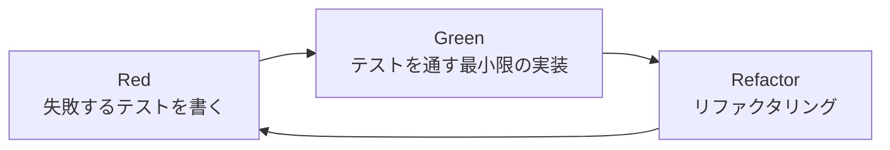
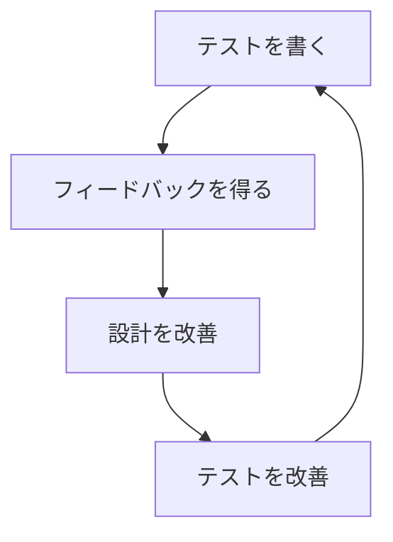

# TDD（テスト駆動開発）実践ガイドライン

## 1. TDDの基本原則（t-wada流）

### 1.1 TDDの黄金の回転



### 1.2 TDDの3つの法則

1. **失敗するテストを書くまで、プロダクトコードを書いてはならない**
2. **失敗させるのに十分なテストだけを書く**（コンパイルエラーも失敗）
3. **現在失敗しているテストを通すのに十分なプロダクトコードだけを書く**

### 1.3 t-wada氏の重要な教え

> "テストがあることではなく、テストを先に書くことに価値がある"

- テストは設計行為である
- テストファーストは設計を改善する
- テストは仕様書である

## 2. 実践的なTDDサイクル

### 2.1 サイクルの詳細

#### STEP 1: Red（失敗するテストを書く）
```typescript
// ❌ まだ実装がないので失敗する
describe('Score', () => {
  it('正確性35%、効率性25%、保守性25%、速度15%の重み付けで計算される', () => {
    const score = Score.calculate({
      accuracy: 100,
      efficiency: 80,
      maintainability: 90,
      speed: 70
    })
    
    // 100*0.35 + 80*0.25 + 90*0.25 + 70*0.15 = 88
    expect(score.value).toBe(88)
  })
})
```

#### STEP 2: Green（最小限の実装）
```typescript
// ✅ テストを通す最小限の実装
export class Score {
  constructor(public readonly value: number) {}
  
  static calculate(metrics: Metrics): Score {
    const value = 
      metrics.accuracy * 0.35 +
      metrics.efficiency * 0.25 +
      metrics.maintainability * 0.25 +
      metrics.speed * 0.15
    
    return new Score(Math.round(value))
  }
}
```

#### STEP 3: Refactor（リファクタリング）
```typescript
// ♻️ テストが通る状態を保ちながら改善
export class Score {
  private static readonly WEIGHTS = {
    accuracy: 0.35,
    efficiency: 0.25,
    maintainability: 0.25,
    speed: 0.15
  } as const
  
  private constructor(public readonly value: number) {
    if (value < 0 || value > 100) {
      throw new Error('Score must be between 0 and 100')
    }
  }
  
  static calculate(metrics: Metrics): Score {
    const weightedSum = Object.entries(this.WEIGHTS).reduce(
      (sum, [key, weight]) => sum + metrics[key] * weight,
      0
    )
    
    return new Score(Math.round(weightedSum))
  }
}
```

### 2.2 テストの粒度

```typescript
// 🎯 良いテスト：1つの振る舞いをテスト
it('プレゼンテーション層からインフラ層への直接依存を検出する', () => {
  const validator = new DependencyValidator()
  const result = validator.validate({
    from: LayerType.Presentation,
    to: LayerType.Infrastructure
  })
  
  expect(result.isValid).toBe(false)
  expect(result.violation).toBe('INVALID_DEPENDENCY')
})

// ❌ 悪いテスト：複数の振る舞いをテスト
it('依存関係を検証する', () => {
  // 複数のケースを1つのテストに詰め込んでいる
  // ...
})
```

## 3. レイヤー別TDD実践

### 3.1 ドメイン層のTDD

#### テストファースト実装例
```typescript
// domain/models/__tests__/layer-structure.spec.ts

describe('LayerStructure', () => {
  describe('ブロック配置のルール', () => {
    it('UIコンポーネントはプレゼンテーション層にのみ配置可能', () => {
      // Arrange
      const structure = new LayerStructure()
      const uiBlock = new CodeBlock('Button', BlockType.UIComponent)
      
      // Act & Assert - プレゼンテーション層には配置可能
      const presentationResult = structure.addBlock(
        LayerId.Presentation, 
        uiBlock
      )
      expect(presentationResult.isSuccess()).toBe(true)
      
      // Act & Assert - ドメイン層には配置不可
      const domainResult = structure.addBlock(
        LayerId.Domain,
        uiBlock
      )
      expect(domainResult.isFailure()).toBe(true)
      expect(domainResult.error).toContain('UIコンポーネント')
    })
    
    it('エンティティはドメイン層にのみ配置可能', () => {
      // Arrange
      const structure = new LayerStructure()
      const entity = new CodeBlock('User', BlockType.Entity)
      
      // Act & Assert
      const result = structure.addBlock(LayerId.Domain, entity)
      
      expect(result.isSuccess()).toBe(true)
    })
  })
  
  describe('依存関係のルール', () => {
    it('ドメイン層は他の層に依存できない', () => {
      // Arrange
      const structure = new LayerStructure()
      const domainBlock = new CodeBlock('UserEntity', BlockType.Entity)
      const appBlock = new CodeBlock('UserService', BlockType.Service)
      
      structure.addBlock(LayerId.Domain, domainBlock)
      structure.addBlock(LayerId.Application, appBlock)
      
      // Act
      const result = structure.createConnection(
        domainBlock.id,
        appBlock.id
      )
      
      // Assert
      expect(result.isFailure()).toBe(true)
      expect(result.error).toBe('ドメイン層は他の層に依存できません')
    })
  })
})
```

### 3.2 アプリケーション層のTDD

```typescript
// application/usecases/__tests__/start-game-session.spec.ts

describe('StartGameSessionUseCase', () => {
  let useCase: StartGameSessionUseCase
  let mockSessionRepo: MockType<GameSessionRepository>
  let mockChallengeRepo: MockType<ChallengeRepository>
  
  beforeEach(() => {
    mockSessionRepo = createMock<GameSessionRepository>()
    mockChallengeRepo = createMock<ChallengeRepository>()
    useCase = new StartGameSessionUseCase(
      mockSessionRepo,
      mockChallengeRepo
    )
  })
  
  describe('正常系', () => {
    it('有効なチャレンジIDでセッションを開始できる', async () => {
      // Arrange
      const challenge = ChallengeBuilder.create()
        .withId('ch-001')
        .build()
      
      mockChallengeRepo.findById.mockResolvedValue(challenge)
      mockSessionRepo.save.mockResolvedValue(undefined)
      
      // Act
      const result = await useCase.execute({
        userId: 'user-123',
        challengeId: 'ch-001'
      })
      
      // Assert
      expect(result.isSuccess()).toBe(true)
      expect(result.value).toMatchObject({
        challengeId: 'ch-001',
        state: 'in_progress'
      })
      expect(mockSessionRepo.save).toHaveBeenCalledWith(
        expect.objectContaining({
          userId: 'user-123',
          challengeId: 'ch-001'
        })
      )
    })
  })
  
  describe('異常系', () => {
    it('存在しないチャレンジIDではセッションを開始できない', async () => {
      // Arrange
      mockChallengeRepo.findById.mockResolvedValue(null)
      
      // Act
      const result = await useCase.execute({
        userId: 'user-123',
        challengeId: 'invalid-id'
      })
      
      // Assert
      expect(result.isFailure()).toBe(true)
      expect(result.error.code).toBe('CHALLENGE_NOT_FOUND')
      expect(mockSessionRepo.save).not.toHaveBeenCalled()
    })
  })
})
```

### 3.3 プレゼンテーション層のTDD

```typescript
// presentation/components/__tests__/LayerView.spec.ts

import { mount } from '@vue/test-utils'
import { describe, it, expect, beforeEach } from 'vitest'
import LayerView from '../LayerView.vue'

describe('LayerView', () => {
  describe('ドラッグ&ドロップ', () => {
    it('ブロックをドラッグ開始するとdragstartイベントが発火する', async () => {
      // Arrange
      const wrapper = mount(LayerView, {
        props: {
          layer: {
            id: 'presentation',
            name: 'プレゼンテーション層',
            blocks: [
              { id: 'block-1', name: 'Component', type: 'component' }
            ]
          }
        }
      })
      
      // Act
      const block = wrapper.find('[data-testid="block-1"]')
      await block.trigger('dragstart')
      
      // Assert
      expect(wrapper.emitted('drag-start')).toBeTruthy()
      expect(wrapper.emitted('drag-start')[0]).toEqual([{
        blockId: 'block-1',
        layerId: 'presentation'
      }])
    })
    
    it('ブロックをドロップするとバリデーションが実行される', async () => {
      // Arrange
      const mockValidate = vi.fn().mockResolvedValue({ isValid: true })
      const wrapper = mount(LayerView, {
        props: {
          layer: { id: 'application', name: 'アプリケーション層' },
          onValidateDrop: mockValidate
        }
      })
      
      // Act
      const dropZone = wrapper.find('[data-testid="drop-zone"]')
      await dropZone.trigger('drop', {
        dataTransfer: {
          getData: () => 'block-1'
        }
      })
      
      // Assert
      expect(mockValidate).toHaveBeenCalledWith({
        blockId: 'block-1',
        targetLayerId: 'application'
      })
    })
  })
})
```

## 4. テストダブルの使い方

### 4.1 テストダブルの種類

```typescript
// 1. Stub - 事前定義された値を返す
const stubRepository = {
  findById: (id: string) => Promise.resolve(fixedData)
}

// 2. Mock - 期待される呼び出しを検証
const mockRepository = {
  save: jest.fn()
}
// 検証
expect(mockRepository.save).toHaveBeenCalledWith(expectedData)

// 3. Spy - 実際のオブジェクトの呼び出しを記録
const spy = jest.spyOn(realRepository, 'save')

// 4. Fake - 簡易実装
class FakeRepository implements Repository {
  private data = new Map()
  
  async save(item: Item): Promise<void> {
    this.data.set(item.id, item)
  }
  
  async findById(id: string): Promise<Item | null> {
    return this.data.get(id) || null
  }
}
```

### 4.2 モックの原則

```typescript
// ✅ 良い例：インターフェースに対してモック
const mockRepo: GameSessionRepository = {
  save: jest.fn(),
  findById: jest.fn(),
  findAll: jest.fn()
}

// ❌ 悪い例：具体的な実装に依存
const mockPrisma = {
  gameSession: {
    create: jest.fn() // 実装の詳細に依存している
  }
}
```

## 5. テスト設計パターン

### 5.1 AAA（Arrange-Act-Assert）パターン

```typescript
it('循環依存を検出する', () => {
  // Arrange - 準備
  const validator = new CyclicDependencyValidator()
  const connections = [
    { from: 'A', to: 'B' },
    { from: 'B', to: 'C' },
    { from: 'C', to: 'A' } // 循環
  ]
  
  // Act - 実行
  const result = validator.validate(connections)
  
  // Assert - 検証
  expect(result.hasCycle).toBe(true)
  expect(result.cycle).toEqual(['A', 'B', 'C', 'A'])
})
```

### 5.2 Given-When-Then（BDD風）

```typescript
describe('解答提出', () => {
  it('正しい解答を提出すると高スコアを獲得する', () => {
    // Given - 前提条件
    const session = givenActiveGameSession()
    const solution = givenValidSolution()
    
    // When - いつ
    const result = whenSubmitSolution(session, solution)
    
    // Then - その時
    thenScoreShouldBeHigherThan(result, 90)
    thenSessionShouldBeCompleted(session)
  })
})
```

## 6. テストのアンチパターン

### 6.1 避けるべきパターン

```typescript
// ❌ アンチパターン1: テストが実装に密結合
it('saveメソッドがprisma.createを呼ぶ', () => {
  // 実装の詳細をテストしている
})

// ✅ 改善: 振る舞いをテスト
it('セッションを保存できる', () => {
  // 振る舞いをテストする
})

// ❌ アンチパターン2: 巨大なセットアップ
beforeEach(() => {
  // 100行のセットアップコード...
})

// ✅ 改善: ビルダーパターンやファクトリーを使用
beforeEach(() => {
  session = TestDataBuilder.session().build()
})

// ❌ アンチパターン3: マジックナンバー
expect(result.score).toBe(88)

// ✅ 改善: 意図を明確に
const expectedScore = 
  100 * 0.35 + // accuracy
  80 * 0.25 +  // efficiency
  90 * 0.25 +  // maintainability
  70 * 0.15    // speed
expect(result.score).toBe(Math.round(expectedScore))
```

## 7. E2Eテストの TDD

### 7.1 シナリオベースのテスト

```typescript
// e2e/scenarios/complete-challenge.spec.ts

describe('チャレンジ完了シナリオ', () => {
  it('ユーザーがチャレンジを開始して完了するまでの流れ', async () => {
    // Given: ログイン済みユーザー
    await loginAs('test-user')
    
    // When: チャレンジを開始
    await page.goto('/challenges/ch-001')
    await page.click('[data-testid="start-challenge"]')
    
    // Then: ゲーム画面が表示される
    await expect(page).toHaveURL('/game/ch-001')
    
    // When: 正しい解答を構築
    await dragBlock('ui-component', 'presentation-layer')
    await dragBlock('dto', 'application-layer')
    await connectBlocks('ui-component', 'dto')
    
    // When: 解答を提出
    await page.click('[data-testid="submit-solution"]')
    
    // Then: 成功メッセージとスコアが表示される
    await expect(page.locator('.success-message')).toBeVisible()
    await expect(page.locator('.score')).toContainText('95')
  })
})
```

## 8. CI/CDでのTDD

### 8.1 プレコミットフック

```json
// package.json
{
  "husky": {
    "hooks": {
      "pre-commit": "pnpm test:staged",
      "pre-push": "pnpm test:all"
    }
  }
}
```

### 8.2 テストカバレッジの設定

```typescript
// vitest.config.ts
export default defineConfig({
  test: {
    coverage: {
      provider: 'v8',
      reporter: ['text', 'json', 'html', 'lcov'],
      statements: 90,
      branches: 85,
      functions: 90,
      lines: 90,
      exclude: [
        'node_modules/',
        'tests/',
        '*.config.ts',
        '**/*.spec.ts',
        '**/*.test.ts'
      ]
    }
  }
})
```

## 9. テストのメンテナンス

### 9.1 テストのリファクタリング

```typescript
// Before: 重複の多いテスト
it('test1', () => {
  const validator = new Validator()
  const result = validator.validate(data1)
  expect(result.isValid).toBe(true)
})

it('test2', () => {
  const validator = new Validator()
  const result = validator.validate(data2)
  expect(result.isValid).toBe(false)
})

// After: パラメータ化テスト
describe.each([
  ['valid data', data1, true],
  ['invalid data', data2, false]
])('validate(%s)', (description, data, expected) => {
  it(`returns ${expected}`, () => {
    const validator = new Validator()
    const result = validator.validate(data)
    expect(result.isValid).toBe(expected)
  })
})
```

### 9.2 テストの命名規則

```typescript
// 日本語での記述も推奨（t-wada氏も推奨）
describe('LayerStructure', () => {
  describe('addBlock', () => {
    it('UIコンポーネントをプレゼンテーション層に追加できる', () => {})
    it('UIコンポーネントをドメイン層に追加できない', () => {})
  })
})

// 英語の場合
describe('LayerStructure', () => {
  describe('#addBlock', () => {
    it('should add UI component to presentation layer', () => {})
    it('should not add UI component to domain layer', () => {})
  })
})
```

## 10. TDDのベストプラクティス

### 10.1 原則

1. **FIRST原則**
   - Fast: 高速
   - Independent: 独立
   - Repeatable: 再現可能
   - Self-validating: 自己検証可能
   - Timely: タイムリー

2. **テストコードもプロダクトコード**
   - きれいに保つ
   - リファクタリングする
   - レビューする

3. **テストの可読性を重視**
   - テストは仕様書
   - 意図が明確
   - メンテナンスしやすい

### 10.2 継続的な改善



## まとめ

TDDは単なるテスト手法ではなく、**設計手法**です。テストファーストで開発することで：

- ✅ 設計が改善される
- ✅ 仕様が明確になる
- ✅ リファクタリングが安全にできる
- ✅ デバッグ時間が削減される
- ✅ ドキュメントとしてのテスト

継続的にTDDを実践し、より良い設計とコードを生み出していきましょう！

---

最終更新: 2025年1月15日